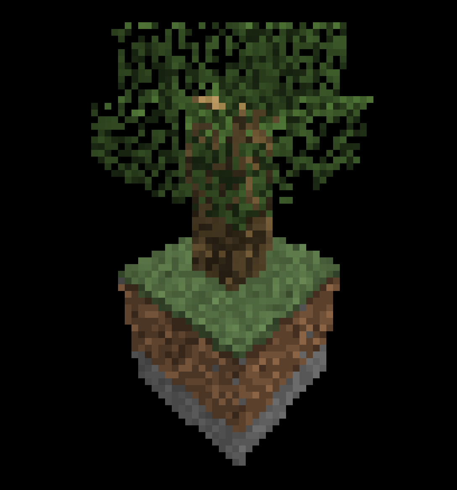
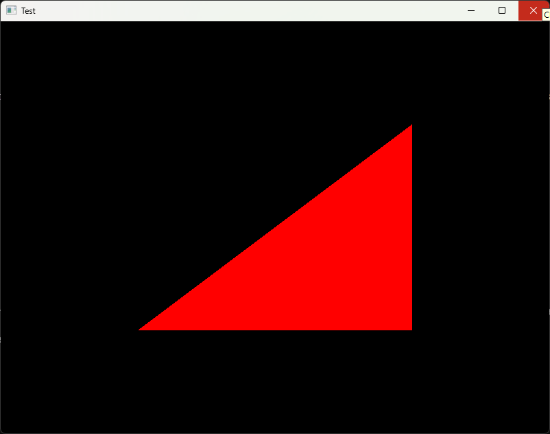
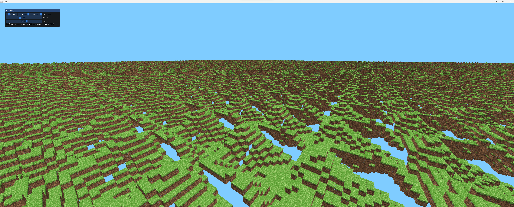

# Learning Computer Graphics

The goal of this project is to understand and implement three-dimensional graphics.

## Low Level Implementation

The first part of the project consists of learning the graphics pipeline and the fundamental mathematics behind each step.

This portion is implemented in JavaScript using the [Canvas API](https://developer.mozilla.org/en-US/docs/Web/API/Canvas_API), which provides a simple way to output an array of pixels to a webpage.

Performance is not a focus of this implementation as it is more of a proof-of-concept.

### Displaying Geometry

The first successful implementation involves projecting three-dimensionally-defined geometry onto a two-dimensional plane.

This implementation does not check for the depth of a triangle/pixel, so the triangles are rendered in the same order that they are defined in the model.

The brightness of each triangle is also based on the order they are defined in the model, which is a simple way of seeing some apparent depth.

The [Utah Teapot](https://en.wikipedia.org/wiki/Utah_teapot) testing model is also read in from a json file to test a higher complexity model.

### Colored Triangle

The next step is to pair each vertex with a color and interpolate between each vertex to get each pixel of the triangle.

### Depth Testing

To implement proper depth ordering of pixels, the depth is interpolated as well as the color.

Then, when a pixel is drawn, only the color with the lowest associated depth is drawn.

This implementation of pixel rasterization involves drawing lines from each vertex and then drawing horizontal lines to fill in the rest of the triangle.

This method is computationally inexpensive, however, the overlapping edges issue in the image above is difficult to fix.

### Edge Function

The edge function method of rasterization involves testing for each pixel whether it lies inside the triangle or not.

This increases the algorithmic complexity of the rasterization process for the CPU, which makes this JavaScript implementation significantly slower.

However, the GPU is made for these types of per-pixel computations, and graphics applications that utilize GPU acceleration would not notice a performance decrease when using the edge function.

Using the edge function removes the overlapping edges issue.

### Textures

The process of applying textures to a model is similar to the interpolation done with the vertex color, with the difference of specifying a texture coordinate for each vertex instead of a color.

Support for multiple textures and triangle brightness is implemented next.

At this point in the project, Minecraft is decided on as a model for learning and implementing the graphics pipeline.

### Clipping

The clipping process involves removing any vertices that are outside of the camering viewing space.

Clipping can increase performance by removing objects and vertices that are not on the screen, but it is also important for removing vertices with negative depth values, which breaks the projection algorithm.

The process of creating new vertices at the intersection of a triangle with the camera viewing space is difficult. The following are images of work-in-progress implementations of clipping.

The vertex positions of the following image are correct, however the texture mapping coordinates are not calculated correctly.

### Multiple Models

Support for multiple cube models with different textures as well as transparency is implemented.

The rasterization resolution is lowered to allow for a framerate that makes moving the camera around usable.

Here is a full-resolution image that took a couple of minutes to render a single frame.

At this point, the performance has reached a point where it is difficult to continue learning and implementing the graphic pipeline without lowering the resolution to an unusable degree.

As such, the decision is made to learn OpenGL and C++.

## OpenGL and C++

With OpenGL and C++, the GPU, low-level memory control, and high-level abstractions can be utilized to create highly performant, readable, and scalable graphics programs.

### OpenGL Basics

After spending a while getting used to C++ programming and the imperative programming paradigm that OpenGL uses, a window is created with a simple triangle render.

Textures are implemented with relative ease.

After some time, a rotating cube is rendered with textures and depth-testing.

The ImGUI library is also used for a simple debugging user interface.

### Many Cubes

With the extra performance boost, thousands of cubes can be rendered without a huge decrease in performance.

However, the way in which the programmer uses OpenGL to communicate between the CPU and GPU can have a highly significant impact on performance.

The goal should be to reduce the amount of times the CPU has to communicate with the GPU, such as when initiating a draw-call, setting a shader uniform, or changing other OpenGL settings.

Ideally, only the view-model-projection matrix shader uniform should be set each frame, instead of recreating a new vertex array and passing the model data again each frame.

In a world filled with cubes, the process of chunking can be used to reduce draw-calls. Chunking splits the world into smaller segments of model data and draws all of those models together in one draw-call.

### Procedural Terrain

In the following image, the height of each block is randomized.

In this image, the height of each block is determined by the [Perlin noise](https://en.wikipedia.org/wiki/Perlin_noise) function, however, every chunk uses the same relative noise position.

This is adjusted to take into account the chunk's position and shift the noise function accordingly.

Fog is also added in the fragment shader by mixing a fragments texture color with the background color based on its depth. Fragments with higher depth will be closer to the background color.

The noise function can be adjusted and layered to create more interesting terrain.

### Eye Candy

Visual features are added, such as different block types with different textures, and ambient occlusion.

Ambient occlusion gives the blocks a much more realistic lighting appearance.

### Performance

Even with chunking, the performance starts to drop at high render distances.

As such, the search for decreases CPU to GPU communication begins, starting with instancing.

### Instancing

With OpenGL instancing, and object's geometry can be defined once, and multiple copies can be rendered with the only difference being their position.

This allows tens of millions of blocks to be rendered with minimal performance drop.

However, this comes at the cost of flexibility.

Block faces that are covered by other blocks must be removed in a process called face culling to improve performance. This is a more significant performance improvement than instancing, so we must prioritize face culling over instancing.

A possibile solution is to make each individual face its on instance. Unfortunately, this requires six separate instancing draw-calls, which essentially eliminates the performance improvements otherwise experienced.

### Octree

Another possible performance improvement is using an [octree](https://en.wikipedia.org/wiki/Octree), which is a data structure that can allow for a level-of-detail system, less memory usage, easier geometry culling, and other significant performance improvements.

Implementing octrees in this engine proves to be extremely difficult, however, and I soon get distracted with procedural terrain again.

### Better Procedural Terrain

By creating more complex multi-noise interactions, fairly realistic-looking terrain can be generated.

Here, the shaders determine the terrain color based on its height, implying water, sand, grass, and snow.

To achieve even more realistic terrain, the real-world processes of terrain formation are researched, leading to the tangent of studying of hydraulic erosion.

### Hydraulic Erosion

First, recursive algorithms are created to recreate the basic shape of rivers.

However, this is not procedural, and there is no easy way to prevent overlapping river branches.

A potentially better method is to create a semi-accurate model of rain droplets eroding a surface.

Here, the branching paths are visible, and flat sections are present where the paths meet at low-spots.

For this simulation, blocks are abandoned for a connected mesh, and light diffusion based on surface normals are implemented for a better visualization of the terrain shape. 

## Wrapping Up

There is still more to learn and explore, such as OpenGL optimizations, octree implementation, and realistic and procedural terrain.

However, this project provides a thorough look into the process of computer graphics and creating feature-filled applications with graphics.

The following topics were explored:

* Mathematics
    * Vector arithmetic
    * Matrix transformations
    * Edge function
    * Multi-dimensional interpolation
    * Octrees
    * Perlin noise
        * Layered noise
        * Three-dimensional noise
* Graphics pipeline
    * Projection
    * Rasterization
    * Clipping
* OpenGL
    * CPU to GPU communication
    * Vertex arrays and buffers
    * Vertex attributes
    * Shaders
        * Uniforms
        * Vertex shaders
        * Fragment shaders
        * Programming in GLSL
    * Texture arrays
    * Instancing
* C++
    * OpenGL abstraction
    * Memory management
    * Data packing
    * Object-oriented programming
    * Imperative programming
* Hydraulic erosion

All source code is available under the `projects` directory.

## Sources

* https://en.wikipedia.org/wiki/Graphics_pipeline
* https://en.wikipedia.org/wiki/3D_projection
* https://www.scratchapixel.com/lessons/3d-basic-rendering/rasterization-practical-implementation/rasterization-stage.html
* https://gabrielgambetta.com/computer-graphics-from-scratch/11-clipping.html
* https://www.scratchapixel.com/lessons/mathematics-physics-for-computer-graphics/interpolation/introduction.html
* https://en.wikipedia.org/wiki/Clipping_(computer_graphics)
* https://math.stackexchange.com/questions/576137/finding-a-point-on-a-3d-line
* https://computergraphics.stackexchange.com/questions/1866/how-to-map-square-texture-to-triangle
* https://www.youtube.com/watch?v=hRInLNR9iRg
* https://www.youtube.com/watch?v=1s8C9dXRXmM&t=401s
* https://stackoverflow.com/questions/19350792/calculate-normal-of-a-single-triangle-in-3d-space
* https://docs.gl/
* https://stackoverflow.com/questions/15821969/what-is-the-proper-way-to-modify-opengl-vertex-buffer
* https://www.khronos.org/opengl/wiki/Calculating_a_Surface_Normal
* https://learnopengl.com/Advanced-OpenGL/Instancing
* https://gamedev.stackexchange.com/questions/182214/optimization-of-rendering-of-cube-world
* https://community.khronos.org/t/drawing-millions-cubes/65864/6
* https://stackoverflow.com/questions/22948068/opengl-rendering-lots-of-cubes
* https://community.khronos.org/t/does-the-use-of-geometric-shaders-significantly-reduce-performance/106326
* https://stackoverflow.com/questions/10048018/opengl-camera-rotation
* https://stackoverflow.com/questions/28647702/applying-perspective-with-glsl-matrix
* https://stackoverflow.com/questions/47402766/switching-between-windowed-and-full-screen-in-opengl-glfw-3-2
* https://stackoverflow.com/questions/21421074/how-to-create-a-full-screen-window-on-the-current-monitor-with-glfw
* https://stackoverflow.com/questions/67021071/how-to-center-an-opengl-window-with-glfw
* https://gamedev.stackexchange.com/questions/102389/how-to-implement-index-buffer-object-ibos-with-texture-coordinates-in-opengl
* https://stackoverflow.com/questions/12372058/how-to-use-gl-texture-2d-array-in-opengl-3-2
* https://stackoverflow.com/questions/27345340/how-do-i-render-multiple-textures-in-modern-opengl
* https://stackoverflow.com/questions/50091337/sampler2darray-setup-and-use
* https://stackoverflow.com/questions/8844585/glm-rotate-usage-in-opengl
* https://www.youtube.com/playlist?list=PLlrATfBNZ98foTJPJ_Ev03o2oq3-GGOS2
* https://stackoverflow.com/questions/44055377/texture-getting-pixelated-instead-of-blurry
* https://stackoverflow.com/questions/44345811/glad-h-giving-error-that-opengl-header-is-included
* https://www.khronos.org/opengl/wiki/Getting_Started
* https://www.youtube.com/watch?v=eaXk97ujbPQ
* https://ranmantaru.com/blog/2011/10/08/water-erosion-on-heightmap-terrain/
* https://sebastian.itch.io/hydraulic-erosion
* https://www.youtube.com/watch?v=B08iDMXYtR8
* https://www.youtube.com/watch?v=_8y9peDmtwg
* https://www.youtube.com/watch?v=UBivwxBgdPQ
* https://www.youtube.com/watch?v=Tzhzgxoowzs
* https://en.wikipedia.org/wiki/Perlin_noise
* https://en.wikipedia.org/wiki/Octree
